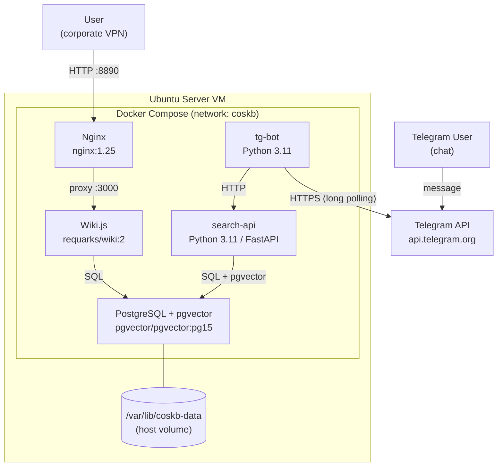
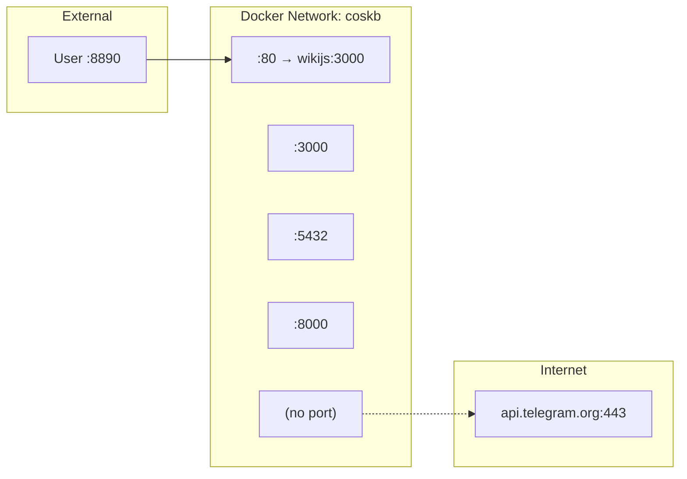

# Architecture Diagram

## System Components

## Network & Ports

| Container | Image | Exposed Port | Internal Port |
|-----------|-------|-------------|---------------|
| nginx | nginx:1.25 | 8890 (host) | 80 |
| wikijs | requarks/wiki:2 | — | 3000 |
| postgres | pgvector/pgvector:pg15 | — | 5432 |
| search-api | custom (Dockerfile) | — | 8000 |
| tg-bot | custom (Dockerfile) | — | — |
