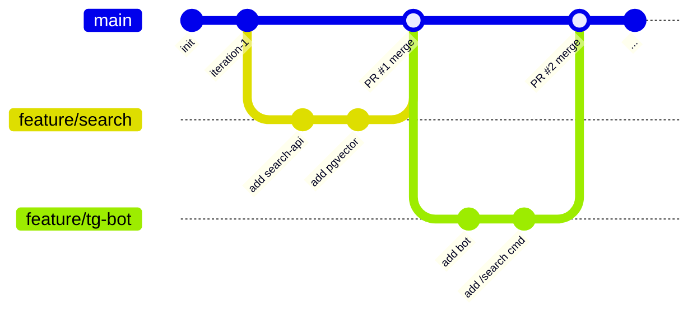
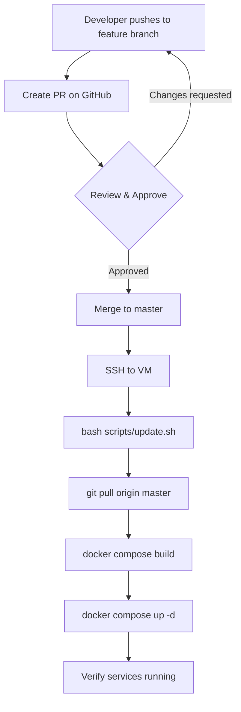
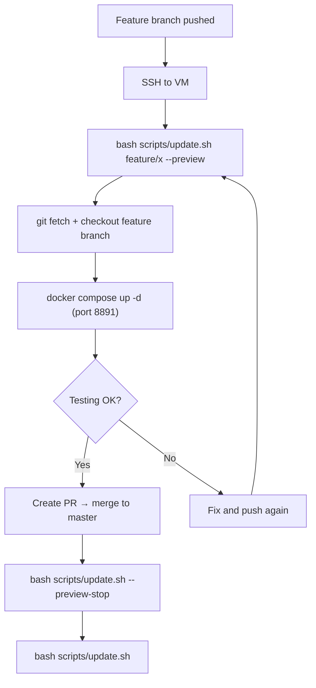

# CI/CD Flow Diagram

## Branching & Deployment

```mermaid
gitGraph
    commit id: "init"
    commit id: "iteration-1"
    branch feature/search
    commit id: "add search-api"
    commit id: "add pgvector"
    checkout main
    merge feature/search id: "PR #1 merge"
    branch feature/tg-bot
    commit id: "add bot"
    commit id: "add /search cmd"
    checkout main
    merge feature/tg-bot id: "PR #2 merge"
    commit id: "..."
```

## Deployment Process

```mermaid
flowchart TD
    A[Developer pushes to feature branch] --> B[Create PR on GitHub]
    B --> C{Review & Approve}
    C -->|Approved| D[Merge to master]
    C -->|Changes requested| A
    D --> E[SSH to VM]
    E --> F["bash scripts/update.sh"]
    F --> G[git pull origin master]
    G --> H[docker compose build]
    H --> I[docker compose up -d]
    I --> J[Verify services running]
```

## Preview Deployment

```mermaid
flowchart TD
    A[Feature branch pushed] --> B[SSH to VM]
    B --> C["bash scripts/update.sh feature/x --preview"]
    C --> D[git fetch + checkout feature branch]
    D --> E["docker compose up -d (port 8891)"]
    E --> F{Testing OK?}
    F -->|Yes| G[Create PR → merge to master]
    F -->|No| H[Fix and push again]
    H --> C
    G --> I["bash scripts/update.sh --preview-stop"]
    I --> J["bash scripts/update.sh"]
```
