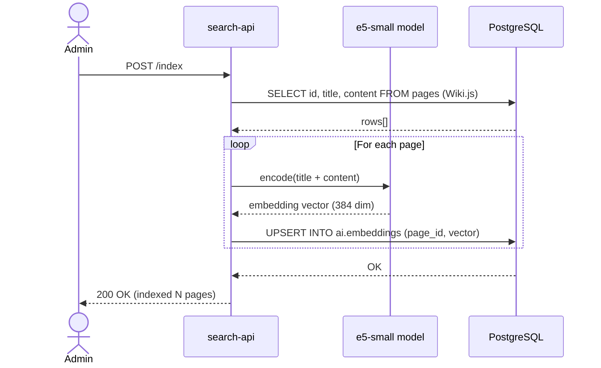
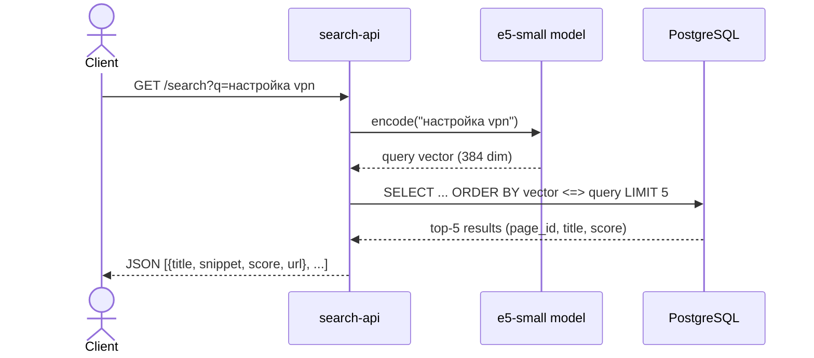
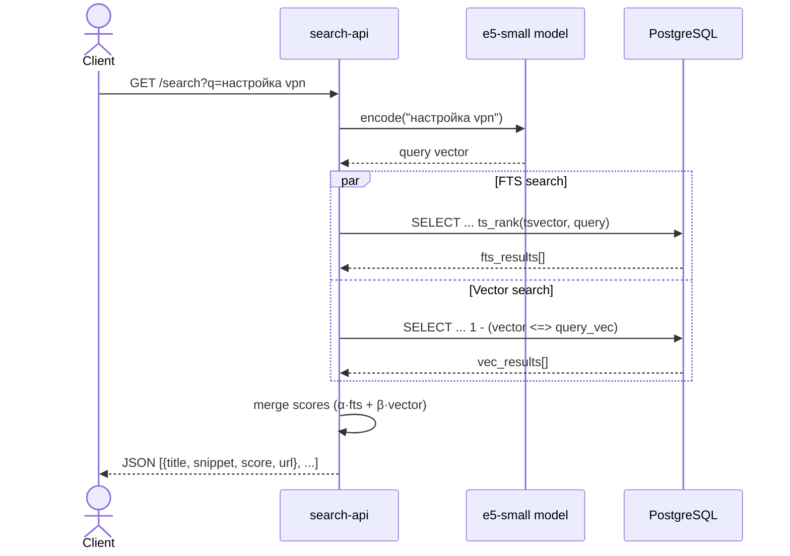

# Search Sequence Diagrams

## Indexing (POST /index)

```mermaid
sequenceDiagram
    actor Admin
    participant API as search-api
    participant Model as e5-small model
    participant PG as PostgreSQL

    Admin->>API: POST /index
    API->>PG: SELECT id, title, content FROM pages (Wiki.js)
    PG-->>API: rows[]
    loop For each page
        API->>Model: encode(title + content)
        Model-->>API: embedding vector (384 dim)
        API->>PG: UPSERT INTO ai.embeddings (page_id, vector)
    end
    PG-->>API: OK
    API-->>Admin: 200 OK (indexed N pages)
```

## Semantic Search (GET /search?q=...)

```mermaid
sequenceDiagram
    actor Client
    participant API as search-api
    participant Model as e5-small model
    participant PG as PostgreSQL

    Client->>API: GET /search?q=настройка vpn
    API->>Model: encode("настройка vpn")
    Model-->>API: query vector (384 dim)
    API->>PG: SELECT ... ORDER BY vector <=> query LIMIT 5
    PG-->>API: top-5 results (page_id, title, score)
    API-->>Client: JSON [{title, snippet, score, url}, ...]
```

## Hybrid Search (iteration 7)

```mermaid
sequenceDiagram
    actor Client
    participant API as search-api
    participant Model as e5-small model
    participant PG as PostgreSQL

    Client->>API: GET /search?q=настройка vpn
    API->>Model: encode("настройка vpn")
    Model-->>API: query vector

    par FTS search
        API->>PG: SELECT ... ts_rank(tsvector, query)
        PG-->>API: fts_results[]
    and Vector search
        API->>PG: SELECT ... 1 - (vector <=> query_vec)
        PG-->>API: vec_results[]
    end

    API->>API: merge scores (α·fts + β·vector)
    API-->>Client: JSON [{title, snippet, score, url}, ...]
```
