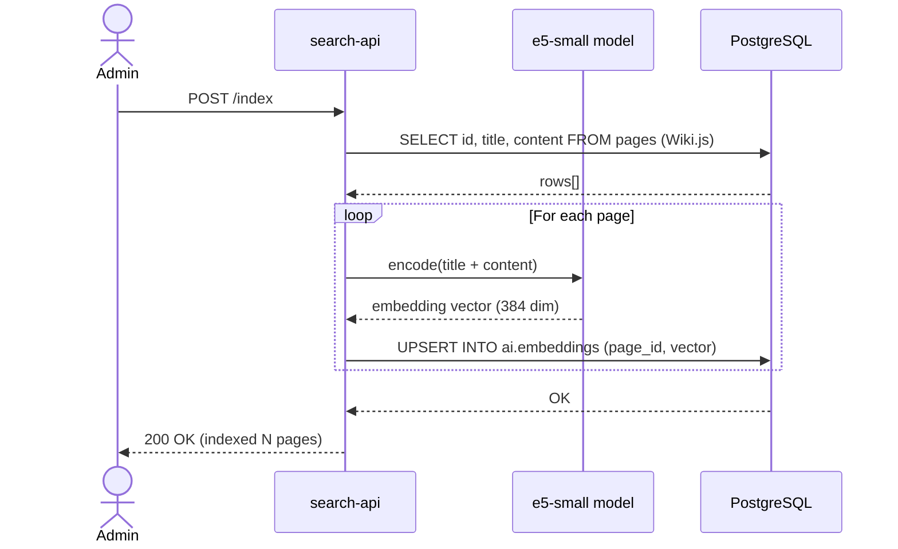
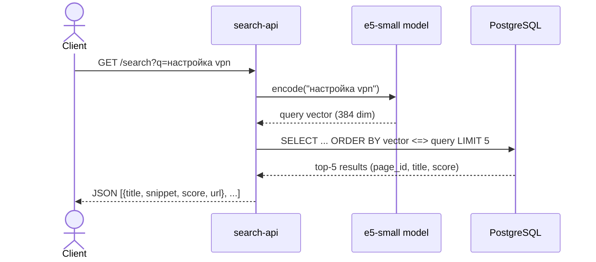
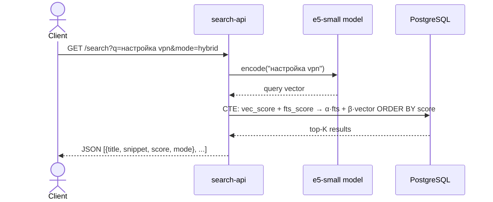

# Search Sequence Diagrams

## Indexing (POST /index)

## Semantic Search (GET /search?q=...)

## Hybrid Search (mode=hybrid, default)

Modes: `hybrid` (default, α=0.4 β=0.6), `vector` (only embeddings), `fts` (only full-text search).
Weights configurable via `FTS_WEIGHT` / `VECTOR_WEIGHT` environment variables.
