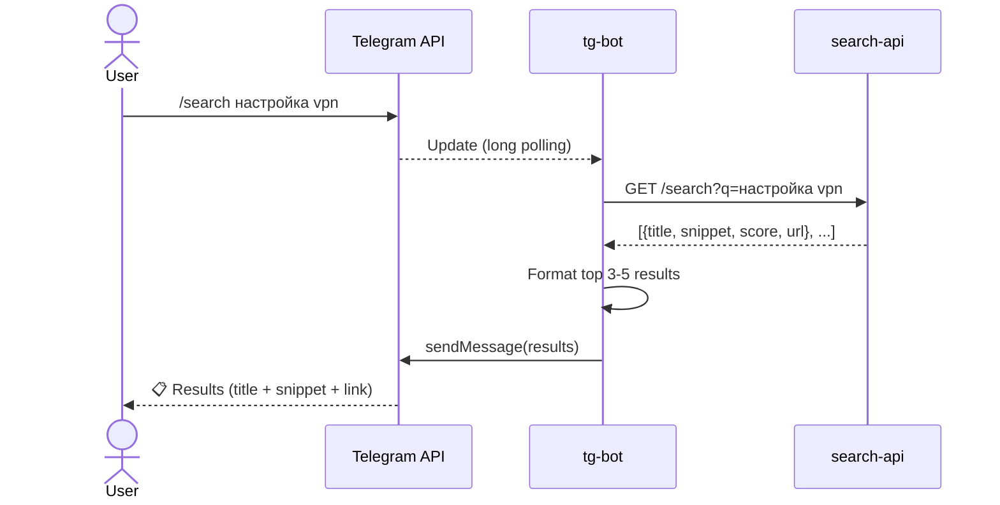
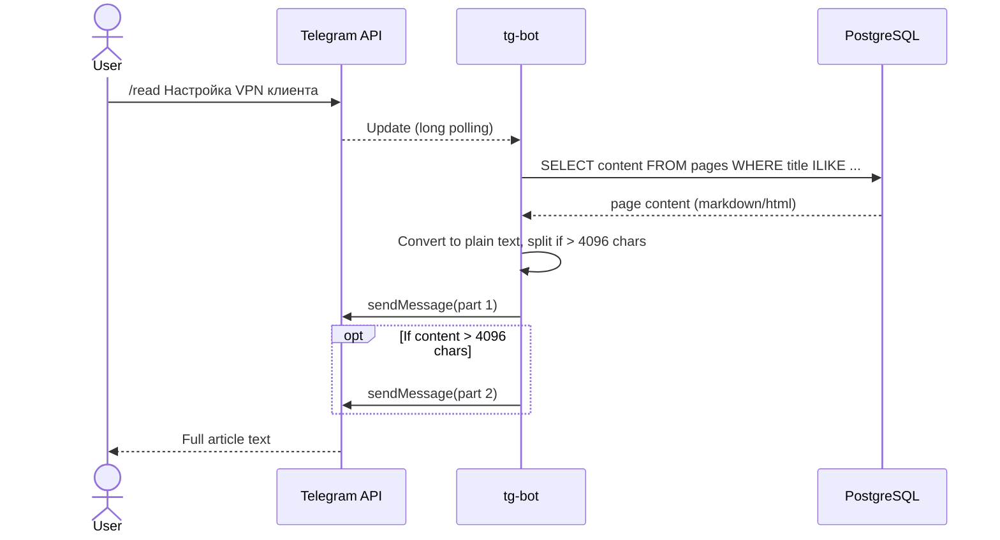
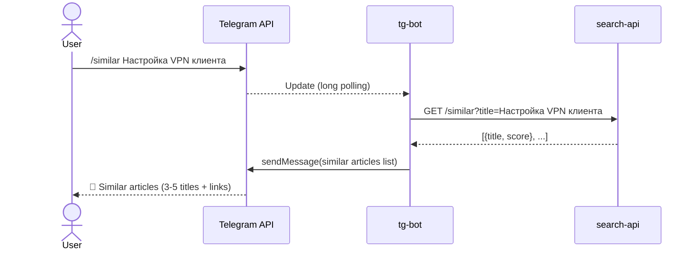
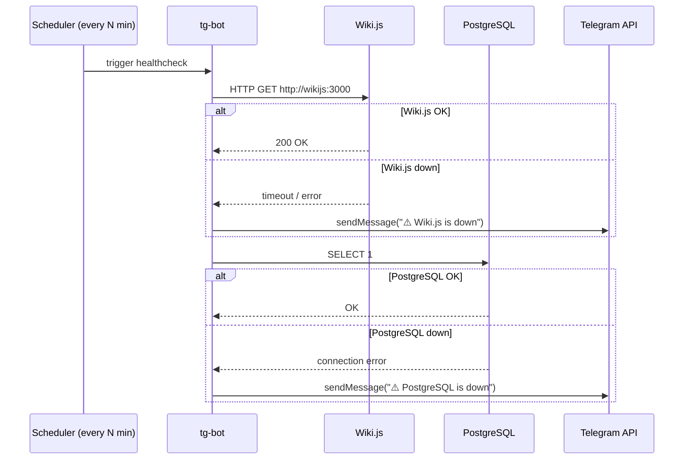

# Telegram Bot Sequence Diagrams

## /search command

```mermaid
sequenceDiagram
    actor User
    participant TG as Telegram API
    participant Bot as tg-bot
    participant API as search-api

    User->>TG: /search настройка vpn
    TG-->>Bot: Update (long polling)
    Bot->>API: GET /search?q=настройка vpn
    API-->>Bot: [{title, snippet, score, url}, ...]
    Bot->>Bot: Format top 3-5 results
    Bot->>TG: sendMessage(results)
    TG-->>User: 📋 Results (title + snippet + link)
```

## /read command

```mermaid
sequenceDiagram
    actor User
    participant TG as Telegram API
    participant Bot as tg-bot
    participant PG as PostgreSQL

    User->>TG: /read Настройка VPN клиента
    TG-->>Bot: Update (long polling)
    Bot->>PG: SELECT content FROM pages WHERE title ILIKE ...
    PG-->>Bot: page content (markdown/html)
    Bot->>Bot: Convert to plain text, split if > 4096 chars
    Bot->>TG: sendMessage(part 1)
    opt If content > 4096 chars
        Bot->>TG: sendMessage(part 2)
    end
    TG-->>User: Full article text
```

## /similar command

```mermaid
sequenceDiagram
    actor User
    participant TG as Telegram API
    participant Bot as tg-bot
    participant API as search-api

    User->>TG: /similar Настройка VPN клиента
    TG-->>Bot: Update (long polling)
    Bot->>API: GET /similar?title=Настройка VPN клиента
    API-->>Bot: [{title, score}, ...]
    Bot->>TG: sendMessage(similar articles list)
    TG-->>User: 📄 Similar articles (3-5 titles + links)
```

## Healthcheck

```mermaid
sequenceDiagram
    participant Timer as Scheduler (every N min)
    participant Bot as tg-bot
    participant WJ as Wiki.js
    participant PG as PostgreSQL
    participant TG as Telegram API

    Timer->>Bot: trigger healthcheck
    Bot->>WJ: HTTP GET http://wikijs:3000
    alt Wiki.js OK
        WJ-->>Bot: 200 OK
    else Wiki.js down
        WJ-->>Bot: timeout / error
        Bot->>TG: sendMessage("⚠️ Wiki.js is down")
    end
    Bot->>PG: SELECT 1
    alt PostgreSQL OK
        PG-->>Bot: OK
    else PostgreSQL down
        PG-->>Bot: connection error
        Bot->>TG: sendMessage("⚠️ PostgreSQL is down")
    end
```
